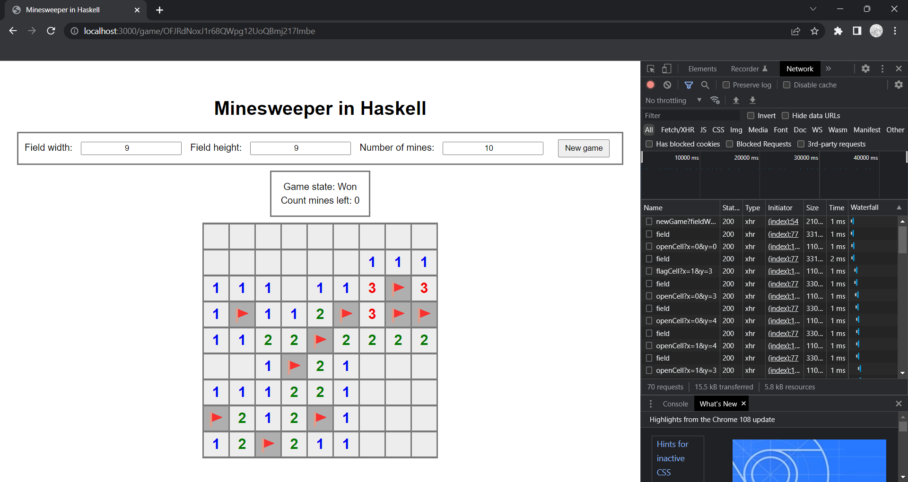

# Minesweeper

- A Minesweeper implementation in Haskell, which has a web interface (using Scotty for the backend).
- Both the model and the server are covered by unit tests.
- You can choose the field size and the number of mines as you wish.

## How to run
- Clone the repository, build & run with stack (install stack [here](https://www.haskell.org/downloads/) if you don't have it).
- Navigate to [http://localhost:3000/](http://localhost:3000/) and play the game!

